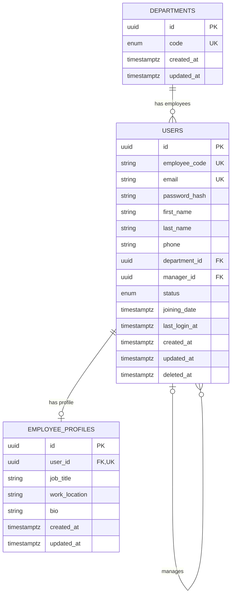

# Employee foundation ERD

```mermaid
erDiagram
  DEPARTMENTS ||--o{ USERS : "has employees"
  USERS o|--o{ USERS : "manages"
  USERS ||--o| EMPLOYEE_PROFILES : "has profile"

  DEPARTMENTS {
    uuid id PK
    enum code UK
    timestamptz created_at
    timestamptz updated_at
  }

  USERS {
    uuid id PK
    string employee_code UK
    string email UK
    string password_hash
    string first_name
    string last_name
    string phone
    uuid department_id FK
    uuid manager_id FK
    enum status
    timestamptz joining_date
    timestamptz last_login_at
    timestamptz created_at
    timestamptz updated_at
    timestamptz deleted_at
  }

  EMPLOYEE_PROFILES {
    uuid id PK
    uuid user_id FK, UK
    string job_title
    string work_location
    string bio
    timestamptz created_at
    timestamptz updated_at
  }
```

Organization boundary: this system serves InterSmart Technologies only. Do not
add an organizations table, `tenant_id`, or `organization_id`.
